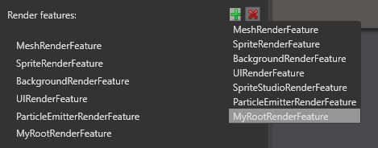
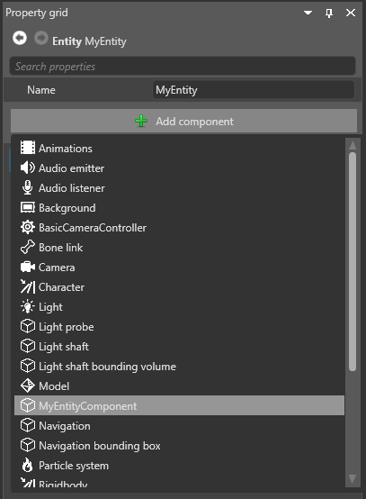
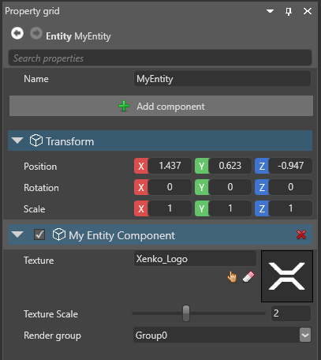
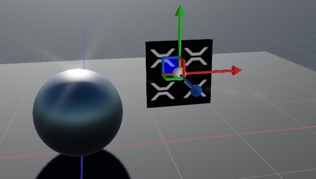

# Stride.CustomRootRenderFeature
Demo implementation of a Stride root render feature that shows up in the Stride graphics compositor. A root render feature can be used to do custom drawing and to build your own shader pipelines with the [Stride low level graphics API](https://github.com/stride3d/stride/tree/master/sources/engine/Stride.Graphics). The advantage of it is, that the drawing will happen with the main camera matrix and backbuffer textures and therefore integrate correctly into the scene rendering.

## Code Overview
 The main parts of the example are  two C# classes and a shader and can be found in the folder [CustomRootRenderFeature.Game\MyRootRenderFeature](CustomRootRenderFeature/CustomRootRenderFeature.Game/MyRootRenderFeature).

If you inherit from RootRenderFeature the custom class shows up in the graphics compositor in GameStudio:



After adding the custom root render feature select it and add a SimpleGroupToRenderStageSelector and select the render stage in which you want to draw. Typically this is the *Opaque* stage.

In order to render something you also need to make a class that inherits from RenderObject. These render objects will then be managed by the engine and passed into the root render feature each frame on Draw. This example also uses a custom shader for rendering.

The order of things should then basically be:
 1. Update render object data
 2. Update shader inputs
 3. Custom draw call

### Manage custom render objects by code
Render objects need to be added and removed to the RenderObjects collection of a VisibilityGroup manually. This can be done in a script as you can see in the [MyRenderObjectManagerScript](CustomRootRenderFeature/CustomRootRenderFeature.Game/ManageRenderObjectByCode/MyRenderObjectManagerScript.cs#L68).

```csharp
var myRenderObject = new MyRenderObject();
myRenderObject.Prepare(GraphicsDevice);
myRenderObject.Color = Color.Red;
myRenderObject.Texture = Content.Load<Texture>("Stride_Logo");
myRenderObject.WorldMatrix = CalcTransformation();
VisibilityGroup.RenderObjects.Add(myRenderObject);
```

### Manage custom render objects in Game Studio
It is also possible to add and remove your custom render objects via the Game Studio UI to the scene. For that you need to implement an EntityComponent that can be added to a game Entity and an EntityProcessor that updates the custom render object and adds it to a visibility group. The example classes can be found in the folder [CustomRootRenderFeature.Game\ManageRenderObjectByGameStudio](CustomRootRenderFeature/CustomRootRenderFeature.Game/ManageRenderObjectByGameStudio)

Once this is done, you can add your entity component to any game entity:



The properties of your entity component will then show up in the UI:



The component will also render in the 3d editor and you can manipulate it with the gizmo of the game entity:




